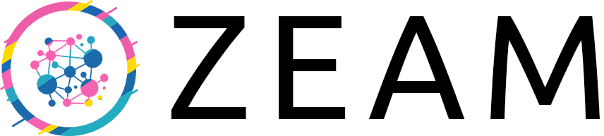

<p align="center"><a href="https://github.com/blockblaz/zeam"></a></p>

[](https://github.com/blockblaz/zeam/actions/workflows/ci.yml)
[](https://github.com/blockblaz/zeam/actions/workflows/risc0.yml)

# zeam - Zig Beam Client

Beam Chain is a futuristic ZK based Ethereum Consensus Protocol first [unveiled in Devcon 7 Bangkok Thailand, Nov 2024](https://www.youtube.com/watch?v=Gjuenkv1zrw)
and is meant to upgrade the current Beacon Chain when ready. Zeam is its production grade implementation (wip).

The heart of Beam Chain is to massively scale and decentralize ethereum consensus with provable and verifiable
protocol via ZK-VMs but also bundles some of the other disruptive ideas and learnings on ethereum consensus which 
could be a bit harder to incrementally implement on the current Beacon Chain.

## Beam Chain

[Beam Chain Developments & Resources](./resources/beam.md)

## Client Development

As is the ethos of ethereum community, beam protocol and specs will be developed in open. Zeam will not only
translate those specs to an production grade zig client but also actively contribute to development of those
specs.

We also will collaborate actively with other Beam clients and collectively will push the protocol to maturity
for consideration and deployment to ethereum blockchain.

We are currently doing various POCs/libs development:

 - [POC of zig run time](https://github.com/blockblaz/zeam-runtime) with various ZK-VMs.
 - [Snappy](https://github.com/blockblaz/zig-snappy) & [Snappy frames](https://github.com/blockblaz/snappyframesz)
 - [Zig <> rust libp2p interops](https://github.com/blockblaz/zig-libp2p-pocs)
 - [Zig SSZ!](https://github.com/blockblaz/ssz.zig)
 - [Hash Signatures](https://github.com/blockblaz/hash-sigz)

And all of these efforts culminating in a [ZEAM POC](./resources/zeam.md) with which we hope to aid in Beam Spec
research especially with state transition proving.

As we go along, we will also be maintaining important [resources](./resources/) related to beam protocol, ZK and
ZK-VMs, and quantum security & updates.

### Zig Ecosystem

Zig despite being relatively new is an upcoming ecosystem stack for ethereum protocol. We will aim to further push
the stack towards maturity via our modular client approach as well as independent libraries development and
contribution.

Please reach out to us if you are actively engaged in developing a library in the ecosystem that you may think
we can use and/or contribute to.

### Zeam community

Please join us on our community to take part in conversations around Beam Protocol and Zeam Client:

- [zeam community](https://t.me/zeamETH) telegram group
- [zeamETH](https://x.com/zeamETH) X(formerly twitter) handle

### Contributions

Zeam will welcome opensource contributions that meaningfully further the development of Zeam client. Keep Watching
out for this space for annoucements on the same or reach out to us via our [community telegram group](https://t.me/zeamETH)

### Build instructions

#### Docker

Docker images are built in CI using `Dockerfile.prebuilt`, which packages pre-built binaries. This avoids intermittent build failures caused by a [Zig HTTP connection pool bug](https://github.com/ziglang/zig/issues/21316) when building inside Docker.

To build a Docker image locally:
```bash
# Build zeam natively first
zig build -Doptimize=ReleaseFast -Dgit_version="$(git rev-parse --short HEAD)"

# Then create Docker image with pre-built binary
docker build -f Dockerfile.prebuilt -t zeam:local .
```

For publishing to a public registry, add OCI labels for better traceability:
```bash
docker build -f Dockerfile.prebuilt \
  --build-arg GIT_COMMIT=$(git rev-parse HEAD) \
  --build-arg GIT_BRANCH=$(git rev-parse --abbrev-ref HEAD) \
  -t blockblaz/zeam:latest .
```

#### Prerequisites

 - Zeam requires zig version 0.14.1 to build.
 - Zeam requires Rust 1.85+ to be able to build the rust connections to various zkvms
 - Both [risc0](https://github.com/risc0/risc0) (v3.0.3) and OpenVM provers are supported:
   - risc0 requires the toolchain to be [installed](https://dev.risczero.com/api/zkvm/install): `rzup install r0vm 3.0.3`
   - OpenVM is self-contained (no external toolchain needed)

#### Build

In order to build the transition functions (one for each supported zkvm), as well as the whole client, type:

```
> zig build -Doptimize=ReleaseFast
```

at the root of the repository.

#### Running the prover demo

```
> zig build -Doptimize=ReleaseFast install run -- prove
```

### Local Lean Devnet

To run a local devnet with multiple nodes for testing and development, see the [Local Devnet Setup Guide](./pkgs/cli/test/fixtures/README.md) which provides detailed instructions for running a 2-node setup with finalization.

or checkout the [lean-quickstart](https://github.com/blockblaz/lean-quickstart) submodule (`git submodule update --init lean-quickstart`) use the handy command line tool to spin up two nodes for local interop.

#### Checkpoint Sync

Zeam supports checkpoint sync for faster initial synchronization. You can start a node from a trusted finalized checkpoint state by using the `--checkpoint-sync-url` parameter. See the [Local Devnet Setup Guide](./pkgs/cli/test/fixtures/README.md#checkpoint-sync) for detailed documentation and examples.

### Testing Scenarios

1. Test blocks by root [parent-sync](./resources/parent-sync.md)
2. Test checkpoint sync [checkpoint-sync](./resources/checkpoint-sync.md)

### Reporting Issues

Open an [issue or a bug](https://github.com/blockblaz/zeam/issues/new) or else talk to us via our [community telegram group](https://t.me/zeamETH). 
